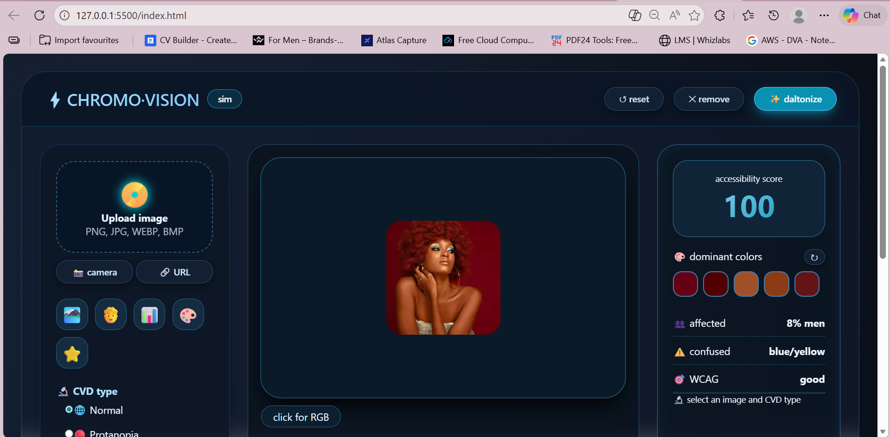
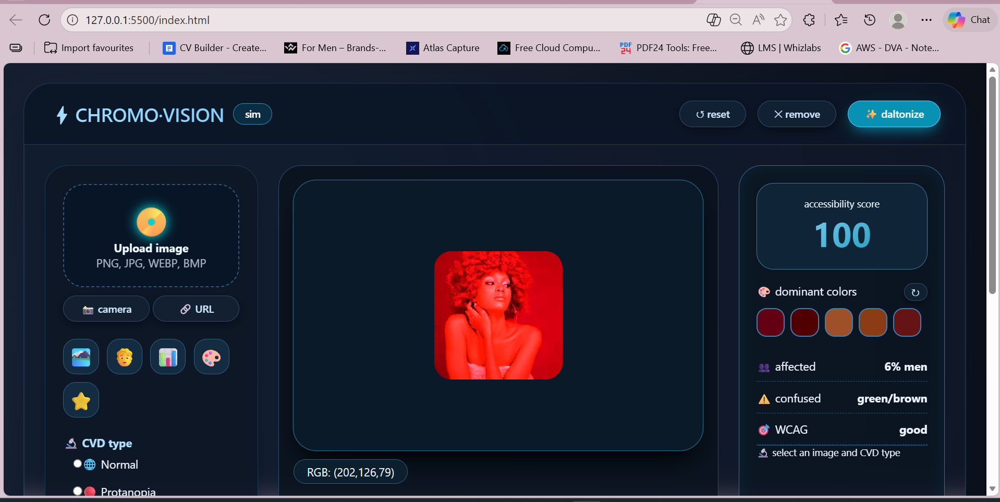
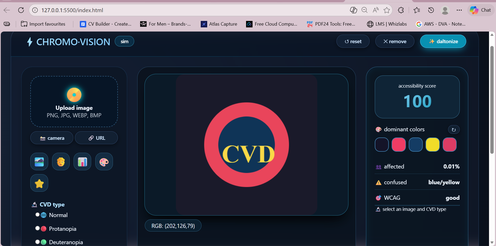

# Colour Blindness Simulator

## What This App Does

Colour Blindness Simulator lets you upload an image and see how it looks to people with different types of colour vision deficiency.

It supports 8 different types of colour blindness.

This app is useful for:

- Designers  
- Developers  
- Students  
- Anyone curious about colour blindness  

---

## How to Load Images

You can add images in four ways:

1. Drag and drop an image into the upload area  
2. Click to browse and select a file  
3. Use the camera to take a photo  
4. Paste an image URL  

Supported formats:

- JPG  
- PNG  
- GIF  
- WebP  
- BMP  

You can also click one of the sample images included in the app.

---

## Colour Blindness Types

The app simulates 8 types of colour vision deficiency.

### Complete Colour Blindness

- Rod Monochromacy  
- Cone Monochromacy  

### Missing One Colour (Dichromacy)

- Protanopia (red-blind)  
- Deuteranopia (green-blind)  
- Tritanopia (blue-blind)  

### Reduced Sensitivity (Anomalous Trichromacy)

- Protanomaly (red-weak)  
- Deuteranomaly (green-weak, most common)  
- Tritanomaly (blue-weak)  

For weak types, you can adjust severity from 0% to 100%.

---

## Daltonize Feature

The daltonize button applies a filter that adjusts colours to make the image easier to see for people with colour blindness.

It attempts to improve accessibility.

---

## Accessibility Information

### Accessibility Score (0–100)

- 90–100: Excellent colour variety  
- 70–89: Good  
- Below 70: Needs improvement  

### Dominant Colours

You can view the 5 main colours in the image.  
Hover to see RGB values.

### Population Statistics

The app also shows:

- Percentage of people affected  
- Common colour confusions  
- Simple contrast rating  

---

## Interactive Tools

### Colour Picker

Click anywhere on the image to see the exact RGB values at that spot.

### Tooltips

Hover over buttons and icons to see explanations.

---

## Visual Settings

You can switch between:

- Dark mode  
- Light mode  

---

## How It Works

The app uses scientific colour transformation formulas called Viénot matrices.

These are used in professional accessibility tools to simulate colour blindness accurately.

All processing happens in your browser.  
No images are uploaded to any server.

---

## Quick Start

1. Upload or select an image  
2. Choose a colour blindness type  
3. Adjust severity if needed  
4. Check the accessibility score  
5. Try the daltonize option  

---

## Tips

- Images with more colour variety usually score higher  
- Red-green colour blindness is the most common  
- Blue-yellow colour blindness is rare  
- Daltonize works best for red-green issues  

---

## Screenshots

